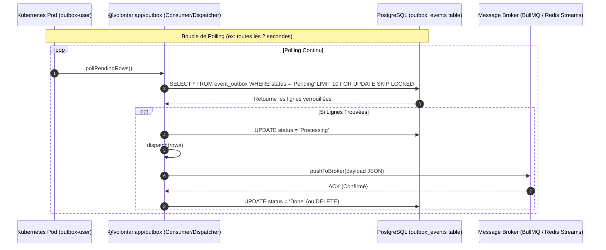

# Architecture & Design Document

## Architecture Overview

Le dépôt `outbox-runners` n'implémente pas la logique fondamentale de l'Outbox (qui réside dans la librairie NPM `@volontariapp/outbox`). Il s'agit d'une **couche d'infrastructure exécutive**.

L'architecture est dite **"Lean Mode"** : contrairement aux microservices (ex: `ms-user`, `ms-post`) qui utilisent NestJS pour l'injection de dépendances et l'exposition d'API, ces runners sont conçus comme de simples processus démons Node.js. Ce choix architectural drastique réduit considérablement le temps de démarrage (Cold Start) et l'utilisation de la RAM, optimisant la densité de déploiement sur Kubernetes.

## Directory Structure

L'arborescence est un monorepo logique isolant chaque domaine métier afin de leur garantir un cycle de vie d'exécution et un scaling indépendant.

```text
outbox-runners/
├── outbox-event/    # Scrute les événements issus du domaine Event
├── outbox-post/     # Scrute les événements issus du domaine Post
├── outbox-social/   # Scrute les événements issus du domaine Social
├── outbox-user/     # Scrute les événements issus du domaine User
├── scripts/         # Outils de scaffolding invoqués par command.sh
└── command.sh       # Script interactif orchestrant le monorepo
```

Chaque sous-dossier (ex: `outbox-user`) contient son propre `package.json`, un `Dockerfile` optimisé et une boucle infinie s'appuyant sur les modules `Consumer`, `Dispatcher` et `Pusher` de la librairie `@volontariapp/outbox`.

## Data Flow & Component Communication

Ce diagramme illustre le fonctionnement interne d'un runner spécifique (ex: `outbox-user`) et comment il orchestre la récupération sécurisée et le dispatch des messages sans perturber le microservice producteur.


*Note : L'utilisation de clauses de verrouillage (ex: `FOR UPDATE SKIP LOCKED`) est critique pour éviter que deux instances du même runner (si scalées horizontalement) ne lisent et ne publient le même événement deux fois.*

## Design Decisions & Trade-offs

### 1. Architecture "Lean Mode" (Pur Node.js)
- **Décision** : Ne pas utiliser NestJS. S'appuyer sur du code impératif et des dépendances fines (ex: `@volontariapp/bridge`).
- **Compromis** : On perd le confort de l'Injection de Dépendances (DI) et de la standardisation des modules offerts par le framework. En contrepartie, le runner gagne énormément en efficacité (CPU/RAM), ce qui est vital pour un processus qui passe 99% de son temps à faire du polling en arrière-plan.

### 2. Séparation par Domaine
- **Décision** : Créer un runner distinct (ex: `outbox-user`, `outbox-event`) plutôt qu'un runner monolithique massif qui scruterait toutes les tables de la base de données globale.
- **Raison** : 
  1. Respecter les Bounded Contexts : la base de données du domaine User n'est peut-être pas la même (ou sur la même instance) que celle du domaine Event.
  2. Granularité du Scaling : Si le domaine "Post" génère 1000 fois plus d'événements que "User", on peut augmenter le nombre de réplicas Kubernetes pour `outbox-post` uniquement.

### 3. Logique de Consommation Centralisée
- **Décision** : Le SQL, le routing et les try/catch liés au réseau Redis se trouvent dans `@volontariapp/outbox`, pas dans les runners.
- **Raison** : DRY (Don't Repeat Yourself). Les développeurs Volontariapp peuvent créer le boilerplate d'un nouveau runner en 1 minute (via `command.sh`) en se contentant d'importer le `Consumer` générique, d'y injecter les configurations réseaux et de le démarrer. 
